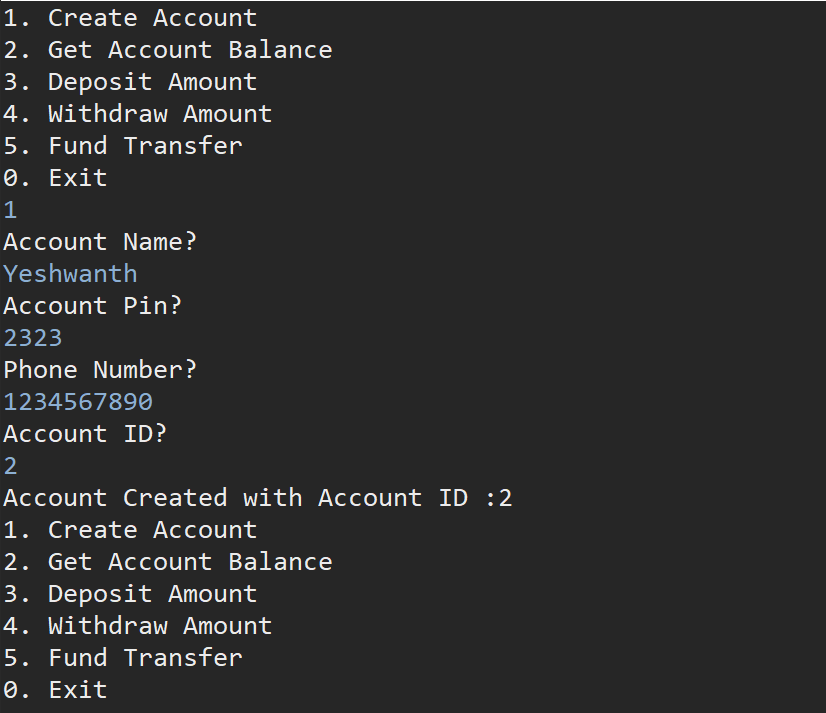
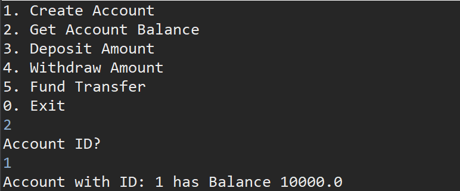
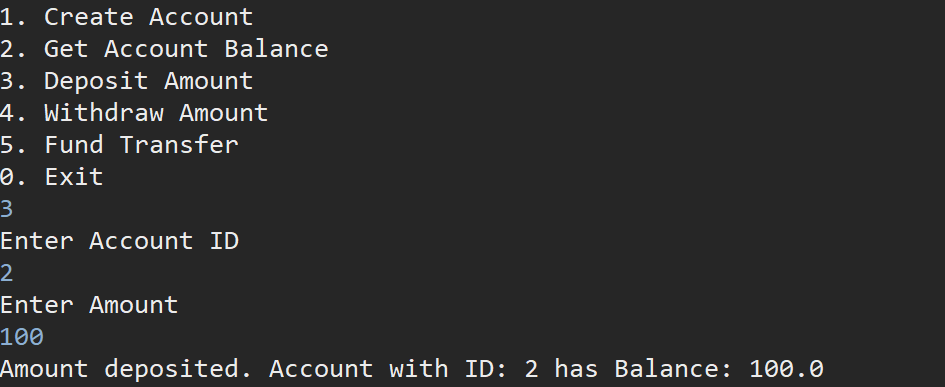
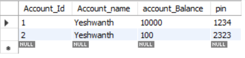
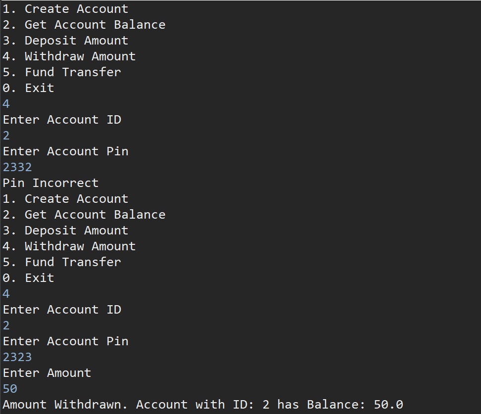
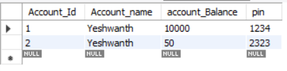
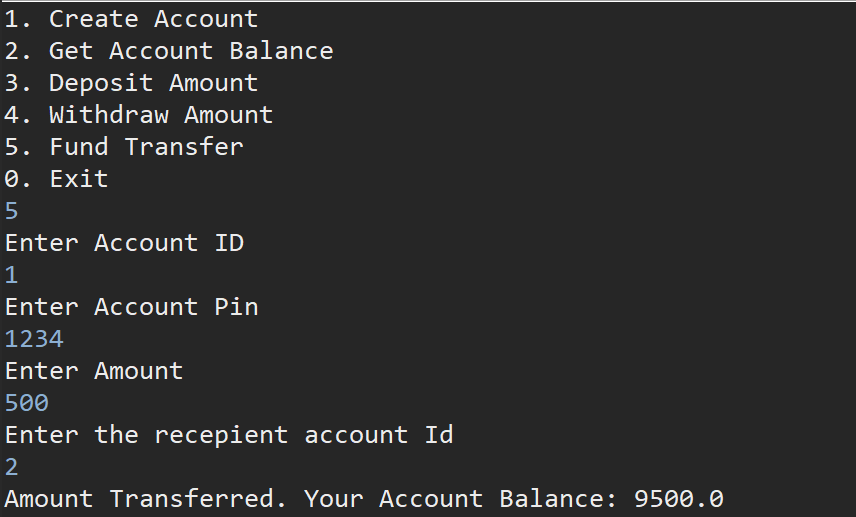

# IbmTrainingAssignment1
I. Create Account:

Database Changes:

II. Get Balance For An Account:

III. Deposit Amount:

Database Changes:

IV. Withdraw Amount:

Databse Changes:

V. Fund Transfer:

Database Changes:

